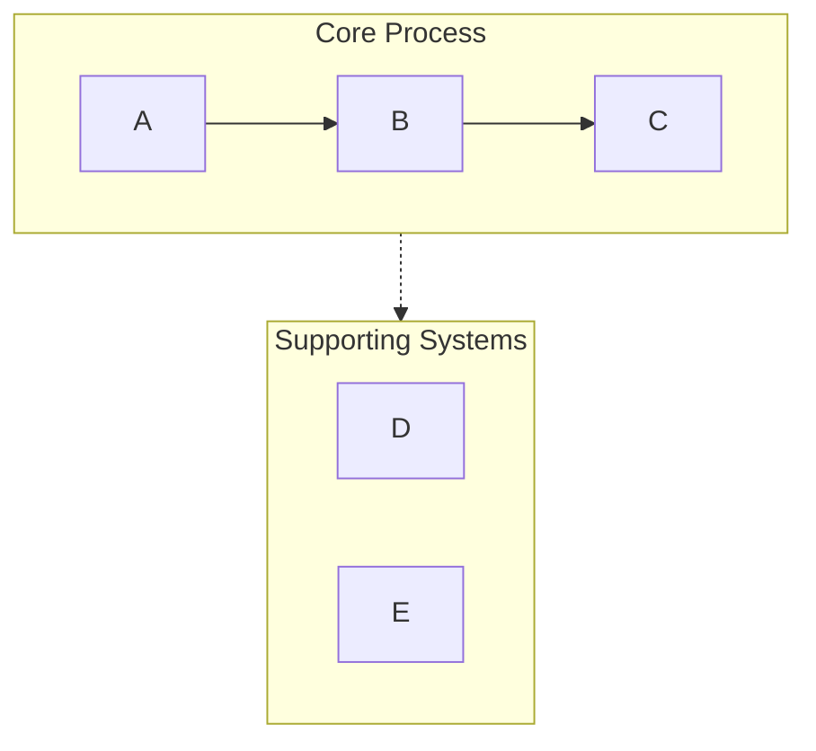
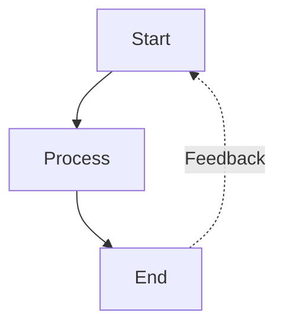
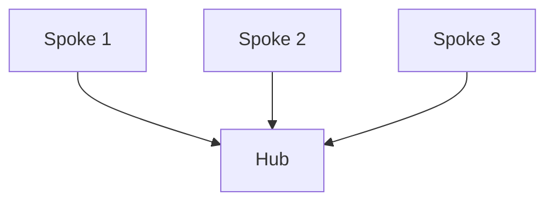

# Mermaid 可视化工具

## 概述

将文本内容转化为简洁、专业的 Mermaid 图表，专为演示和文档场景优化。自动处理常见语法陷阱（列表语法冲突、子图命名、空格问题），确保图表在 Obsidian、GitHub 及其他兼容 Mermaid 的平台上正确渲染。

## 快速开始

创建 Mermaid 图表时：

1. **分析内容** —— 识别关键概念、关系与流程
2. **选择图表类型** —— 挑选最合适的可视化形式（见下方「图表类型」）
3. **确定配置** —— 决定布局、详细程度与样式
4. **生成图表** —— 编写语法正确的 Mermaid 代码
5. **以 Markdown 输出** —— 用合适的代码围栏包裹，并附可选说明

**默认假设：**
- 除非要求横向，否则采用纵向布局（TB）
- 中等详细程度（在简洁与信息量之间取得平衡）
- 带语义化配色的专业配色方案
- 兼容 Obsidian / GitHub 的语法

## 图表类型

### 1. 流程图（graph TB/LR）
**最适合：** 工作流、决策树、顺序流程、AI 智能体架构

**何时使用：** 内容描述步骤、阶段或一系列动作时

**核心特性：**
- 通过 subgraph 形成泳道，分组相关步骤
- 箭头标签表示状态转移
- 反馈回路与分支
- 阶段配色编码

**配置选项：**
- `layout`：「vertical」（TB）、「horizontal」（LR）
- `detail`：「simple」（仅核心步骤）、「standard」（含描述）、「detailed」（含注释）
- `style`：「minimal」、「professional」、「colorful」

### 2. 循环流程图（graph TD，环形布局）
**最适合：** 循环过程、持续改进回路、智能体反馈系统

**何时使用：** 内容强调迭代、反馈或循环关系时

**核心特性：**
- 中心枢纽向外辐射元素
- 弯曲的反馈箭头
- 清晰的循环指示

### 3. 对比图（graph TB，并行路径）
**最适合：** 前后对比、A 与 B 分析、传统系统与现代系统

**何时使用：** 内容对比两种或多种方案、系统时

**核心特性：**
- 左右并列布局
- 中心对比节点
- 通过颜色 / 样式清晰区分

### 4. 思维导图（Mindmap）
**最适合：** 层级概念、知识组织、主题拆解

**何时使用：** 内容呈层级结构，具有清晰的父子关系时

**核心特性：**
- 放射状树形结构
- 多层级嵌套
- 清晰的视觉层次

### 5. 时序图（Sequence Diagram）
**最适合：** 组件间交互、API 调用、消息流

**何时使用：** 内容涉及参与者 / 系统之间随时间发生的通信时

**核心特性：**
- 基于时间线的布局
- 清晰区分参与者
- 用激活框表示处理过程

### 6. 状态图（State Diagram）
**最适合：** 系统状态、状态转移、生命周期阶段

**何时使用：** 内容描述状态及其之间的转移时

**核心特性：**
- 清晰的状态节点
- 带标签的转移
- 起始与终止状态

## 关键语法规则

**务必遵循以下规则以避免解析错误：**

### 规则 1：避免列表语法冲突
```
❌ 错误：[1. 感知]       → 触发「Unsupported markdown: list」
✅ 正确：[1.感知]         → 去掉句点后的空格
✅ 正确：[① 感知]         → 使用带圈数字（①②③④⑤⑥⑦⑧⑨⑩）
✅ 正确：[(1) 感知]       → 使用括号
✅ 正确：[Step 1: 感知]   → 使用「Step」前缀
```

### 规则 2：子图命名
```
❌ 错误：subgraph AI Agent Core  → 名称含空格且未加引号
✅ 正确：subgraph agent["AI Agent Core"]  → 用 ID 加显示名
✅ 正确：subgraph agent          → 仅用简单 ID
```

### 规则 3：节点引用
```
❌ 错误：Title --> AI Agent Core  → 直接引用显示名
✅ 正确：Title --> agent          → 引用子图 ID
```

### 规则 4：节点文本中的特殊字符
```
✅ 含空格的文本用引号包裹：["Text with spaces"]
✅ 转义或避免：双引号 → 改用『』
✅ 转义或避免：圆括号 → 改用「」
✅ 换行仅限圆形节点：((Text<br/>Break))
```

### 规则 5：箭头类型
- `-->` 实线箭头
- `-.->` 虚线箭头（用于支撑系统、可选路径）
- `==>` 粗箭头（用于强调）
- `~~~` 隐形连接（仅用于布局）

完整语法参考与边界情况，见 [references/syntax-rules.md](references/syntax-rules.md)

## 配置选项

所有图表均接受以下参数：

**布局：**
- `direction`：「vertical」（TB）、「horizontal」（LR）、「right-to-left」（RL）、「bottom-to-top」（BT）
- `aspect`：「portrait」（默认）、「landscape」（宽幅）、「square」

**详细程度：**
- `simple`：仅核心元素，标签极简
- `standard`：均衡详细，含关键描述（默认）
- `detailed`：完整注释、说明与元数据
- `presentation`：为幻灯片优化（文字更大、细节更少）

**样式：**
- `minimal`：单色、线条简洁
- `professional`：语义化配色、层次清晰（默认）
- `colorful`：色彩鲜明、高对比度
- `academic`：适用于论文 / 文档的正式样式

**附加选项：**
- `show_legend`：true/false —— 是否包含颜色 / 符号图例
- `numbered`：true/false —— 为步骤添加序号
- `title`：字符串 —— 添加图表标题

## 用法示例模式

**模式 1：基础请求**
```
用户：「可视化软件开发生命周期」
响应：[分析 → 选择 graph TB → 以标准详细程度生成]
```

**模式 2：带配置**
```
用户：「创建一个横向的销售流程图，要非常详细」
响应：[分析 → 选择 graph LR → 以 detailed 程度生成]
```

**模式 3：对比**
```
用户：「对比传统 AI 与 AI 智能体」
响应：[分析 → 选择对比布局 → 以反差样式生成]
```

## 工作流程

1. **理解内容**
   - 识别主要概念、实体与关系
   - 确定层级或顺序
   - 注意任何对比或反差

2. **选择图表类型**
   - 将内容结构匹配到图表类型
   - 考虑用户的演示场景
   - 含义不明时默认采用流程图

3. **选择配置**
   - 应用用户指定的选项
   - 对未指定的选项使用合理默认值
   - 为可读性优化

4. **生成 Mermaid 代码**
   - 严格遵循所有语法规则
   - 使用语义化命名（具描述性的 ID）
   - 应用一致的样式
   - 检查常见错误：
     * 节点文本中无「数字. 空格」模式
     * 所有子图采用 ID["显示名"] 格式
     * 所有节点引用使用 ID 而非显示名

5. **附上下文输出**
   - 用 ```mermaid 代码围栏包裹
   - 简要说明图表结构
   - 提及渲染兼容性（Obsidian、GitHub 等）
   - 主动提出可调整或生成变体

## 默认配色方案

标准专业配色：
- 绿色（#d3f9d8/#2f9e44）：输入、感知、起始状态
- 红色（#ffe3e3/#c92a2a）：规划、决策点
- 紫色（#e5dbff/#5f3dc4）：处理、推理
- 橙色（#ffe8cc/#d9480f）：动作、工具使用
- 青色（#c5f6fa/#0c8599）：输出、执行、结果
- 黄色（#fff4e6/#e67700）：存储、记忆、数据
- 粉色（#f3d9fa/#862e9c）：学习、优化
- 蓝色（#e7f5ff/#1971c2）：元数据、定义、标题
- 灰色（#f8f9fa/#868e96）：中性元素、传统系统

## 常用模式

### 泳道模式（分组）


### 反馈回路模式


### 中心辐射模式


## 质量检查清单

输出前，请逐项核对：
- [ ] 任何节点文本中均无「数字. 空格」模式
- [ ] 所有子图使用正确的 ID 语法
- [ ] 所有箭头使用正确语法（-->、-.->）
- [ ] 配色应用一致
- [ ] 已指定布局方向
- [ ] 包含样式声明
- [ ] 无含义不明的节点引用
- [ ] 兼容 Obsidian / GitHub 渲染器
- [ ] **无 Emoji** —— 任何节点文本中都不使用 Emoji，改用文字标签或颜色编码

## 参考资料

详细语法规则与故障排查，见：
- [references/syntax-rules.md](references/syntax-rules.md) —— 完整语法参考与错误预防
