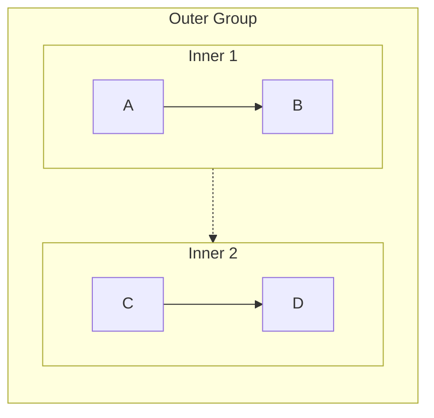
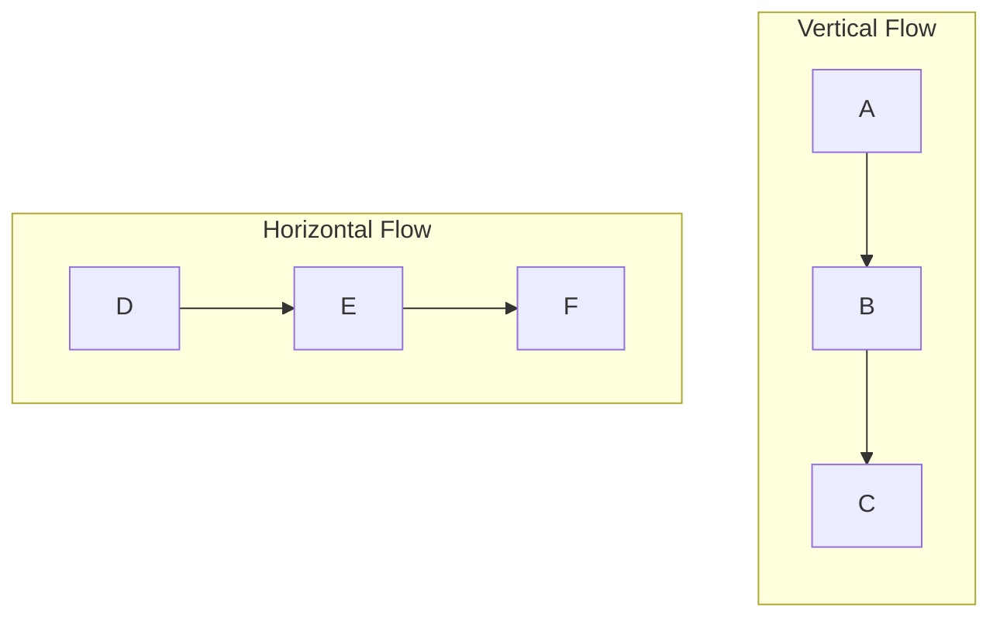
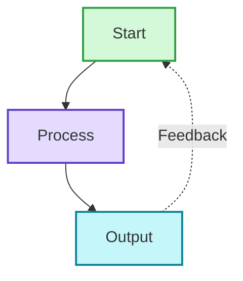
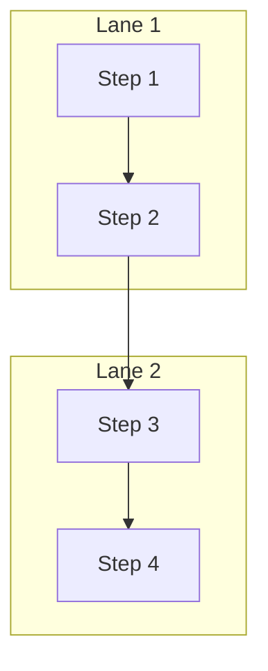
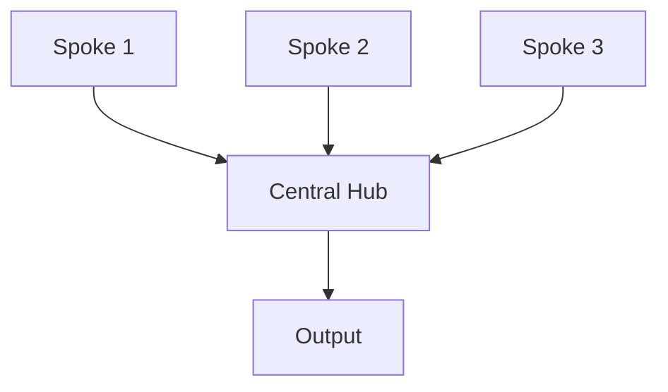

# Mermaid 语法规则参考

本参考提供 Mermaid 图表的全面语法规则与错误预防策略。当遇到语法错误或需要详细语法信息时加载本文件。

## 目录

1. [关键错误预防](#关键错误预防)
2. [节点语法](#节点语法)
3. [子图语法](#子图语法)
4. [箭头与连接类型](#箭头与连接类型)
5. [样式与配色](#样式与配色)
6. [布局与方向](#布局与方向)
7. [进阶模式](#进阶模式)
8. [故障排查](#故障排查)

## 关键错误预防

### 列表语法冲突（最常见错误）

**问题：** Mermaid 解析器会把「数字. 空格」解读为 Markdown 有序列表语法。

**错误信息：** `Parse error: Unsupported markdown: list`

**解决方案：**

```mermaid
❌ [1. 感知]
❌ [2. 规划]
❌ [3. 推理]

✅ [1.感知]              # 去掉空格
✅ [① 感知]             # 使用带圈数字
✅ [(1) 感知]           # 使用括号
✅ [Step 1: 感知]       # 使用前缀
✅ [Step 1 - 感知]      # 使用短横线
✅ [感知]               # 去掉编号
```

**带圈数字参考：**
```
① ② ③ ④ ⑤ ⑥ ⑦ ⑧ ⑨ ⑩ ⑪ ⑫ ⑬ ⑭ ⑮ ⑯ ⑰ ⑱ ⑲ ⑳
```

### 子图命名规则

**规则：** 含空格的子图必须采用「ID + 显示名」格式。

```mermaid
❌ subgraph Core Process
     A --> B
   end

✅ subgraph core["Core Process"]
     A --> B
   end

✅ subgraph core_process
     A --> B
   end
```

**引用子图：**
```mermaid
❌ Title --> Core Process      # 不能引用显示名
✅ Title --> core              # 必须引用 ID
```

### 节点引用规则

**规则：** 始终通过 ID 引用节点，绝不使用显示文本。

```mermaid
# 定义节点
A[显示文本 A]
B["显示文本 B"]

# 引用节点
A --> B                        ✅ 使用节点 ID
显示文本 A --> 显示文本 B        ❌ 不能使用显示文本
```

## 节点语法

### 基本节点类型

```mermaid
# 矩形（默认）
A[矩形文本]

# 圆角矩形
B(圆角文本)

# 体育场形
C([体育场文本])

# 圆形
D((圆形<br/>文本))

# 不对称形
E>右箭头]

# 菱形（决策）
F{决策？}

# 六边形
G{{六边形}}

# 平行四边形
H[/平行四边形/]

# 数据库
I[(数据库)]

# 梯形
J[/梯形\]
```

### 节点文本规则

**换行：**
- `<br/>` 仅在圆形节点中生效：`((Text<br/>Break))`
- 其他节点请使用独立的注释节点，或保持文本简短

**特殊字符：**
- 空格：必要时用引号包裹：`["Text with spaces"]`
- 双引号：替换为『』或避免使用
- 圆括号：替换为「」或避免使用
- 冒号：通常安全，但若引发问题则避免
- 连字符 / 短横线：可安全使用

**长度建议：**
- 节点文本控制在 50 个字符以内
- 对较长内容使用多行（圆形节点）或独立的注释节点
- 文本过长时考虑拆分为多个节点

## 子图语法

### 基本结构

```mermaid
graph TB
    # 含 ID 和显示名的正确格式
    subgraph id["Display Name"]
        direction TB
        A --> B
    end

    # 仅简单 ID（无空格）
    subgraph simple
        C --> D
    end

    # 可在子图内部设置方向
    subgraph horiz["Horizontal"]
        direction LR
        E --> F
    end
```

### 嵌套子图



**限制：** 为保证可读性，嵌套最多 2 层。

### 连接子图

```mermaid
graph TB
    subgraph g1["Group 1"]
        A[Node A]
    end

    subgraph g2["Group 2"]
        B[Node B]
    end

    # 连接单个节点（推荐）
    A --> B

    # 连接子图（为布局创建隐形连接）
    g1 -.-> g2
```

## 箭头与连接类型

### 基本箭头

```mermaid
A --> B          # 实线箭头
A -.-> B         # 虚线箭头
A ==> B          # 粗箭头
A ~~~> B         # 隐形连接（仅用于布局，不渲染）
```

### 箭头标签

```mermaid
A -->|标签文本| B
A -.->|可选| B
A ==>|重要| B
```

### 多目标连接

```mermaid
# 一对多
A --> B & C & D

# 多对一
A & B & C --> D

# 链式
A --> B --> C --> D
```

### 双向

```mermaid
A <--> B         # 双向实线
A <-.-> B        # 双向虚线
```

## 样式与配色

### 内联样式

```mermaid
style NodeID fill:#color,stroke:#color,stroke-width:2px
```

### 颜色格式

- 十六进制：`#ff0000` 或 `#f00`
- RGB：`rgb(255,0,0)`
- 颜色名：`red`、`blue` 等（支持有限）

### 常用样式模式

```mermaid
# 专业外观
style A fill:#d3f9d8,stroke:#2f9e44,stroke-width:2px

# 强调
style B fill:#ffe3e3,stroke:#c92a2a,stroke-width:3px

# 弱化 / 次要
style C fill:#f8f9fa,stroke:#dee2e6,stroke-width:1px

# 标题 / 表头
style D fill:#1971c2,stroke:#1971c2,stroke-width:3px,color:#ffffff
```

### 为多个节点设置样式

```mermaid
# 对多个节点应用相同样式
style A,B,C fill:#d3f9d8,stroke:#2f9e44,stroke-width:2px
```

## 布局与方向

### 方向代码

```mermaid
graph TB    # 自上而下（纵向）
graph BT    # 自下而上
graph LR    # 自左至右（横向）
graph RL    # 自右至左
graph TD    # 自上而下（同 TB）
```

### 布局控制技巧

1. **纵向布局（TB/BT）：** 最适合顺序流程、层级结构
2. **横向布局（LR/RL）：** 最适合时间线、宽屏显示
3. **混合方向：** 在子图中设置不同方向



## 进阶模式

### 反馈回路模式



### 泳道模式



### 中心辐射



### 决策树

```mermaid
graph TB
    Start[Start] --> Decision{Decision Point?}
    Decision -->|Option A| PathA[Path A]
    Decision -->|Option B| PathB[Path B]
    Decision -->|Option C| PathC[Path C]

    PathA --> End[End]
    PathB --> End
    PathC --> End
```

### 对比布局

```mermaid
graph TB
    Title[Comparison]

    subgraph left["System A"]
        A1[Feature 1]
        A2[Feature 2]
        A3[Feature 3]
    end

    subgraph right["System B"]
        B1[Feature 1]
        B2[Feature 2]
        B3[Feature 3]
    end

    Title --> left
    Title --> right

    subgraph compare["Key Differences"]
        Diff[Difference Summary]
    end

    left --> compare
    right --> compare
```

## 故障排查

### 常见错误及解决方案

#### 错误：「Parse error on line X: Expecting 'SEMI', 'NEWLINE', 'EOF'」

**原因：**
1. 含空格的子图名未使用 ID 格式
2. 节点引用使用了显示文本而非 ID
3. 节点文本中含无效特殊字符

**解决方案：**
- 使用 `subgraph id["Display Name"]` 格式
- 仅通过 ID 引用节点
- 对含特殊字符的节点文本加引号

#### 错误：「Unsupported markdown: list」

**原因：** 节点文本中使用了「数字. 空格」模式

**解决方案：** 去掉空格或使用替代写法（①、(1)、Step 1:）

#### 错误：「Parse error: unexpected character」

**原因：**
1. 未转义的特殊字符
2. 引号使用不当
3. 无效的 Mermaid 语法

**解决方案：**
- 替换有问题的字符（双引号 →『』，圆括号 →「」）
- 使用正确的节点定义语法
- 检查箭头语法

#### 图表渲染不正确

**原因：**
1. 缺少样式声明
2. 方向指定错误
3. 连接无效

**解决方案：**
- 确认所有样式声明语法有效
- 检查在 graph 声明或子图中已设置方向
- 确保所有节点 ID 在引用前已定义

### 校验清单

最终确定任何图表前：

- [ ] 节点文本中无「数字. 空格」模式
- [ ] 所有含空格的子图使用正确的 ID 语法
- [ ] 所有节点引用使用 ID 而非显示文本
- [ ] 所有箭头使用有效语法（-->、-.->）
- [ ] 所有样式声明语法正确
- [ ] 已显式设置方向
- [ ] 节点文本中无未转义的特殊字符
- [ ] 所有连接引用的都是已定义的节点

### 平台特别说明

**Obsidian：**
- Mermaid 版本较旧，解析更严格
- `<br/>` 支持有限（仅限圆形节点）
- 最终确定前先测试图表

**GitHub：**
- Mermaid 支持良好
- 可渲染大多数现代语法
- 渲染效果可能与 Obsidian 略有不同

**Mermaid Live Editor：**
- 解析器最新
- 最适合测试新语法
- 可能支持 Obsidian/GitHub 尚不支持的特性

## 速查

### 安全的编号方式
✅ `1.文本` `①文本` `(1)文本` `Step 1:文本`
❌ `1. 文本`

### 安全的子图语法
✅ `subgraph id["Name"]` `subgraph simple_name`
❌ `subgraph Name With Spaces`

### 安全的节点引用
✅ `NodeID --> AnotherID`
❌ `"显示文本" --> "其他文本"`

### 安全的特殊字符
✅ 用『』代替双引号，用「」代替圆括号
❌ 未转义的双引号 `"`，在易出问题处使用的 `()`
